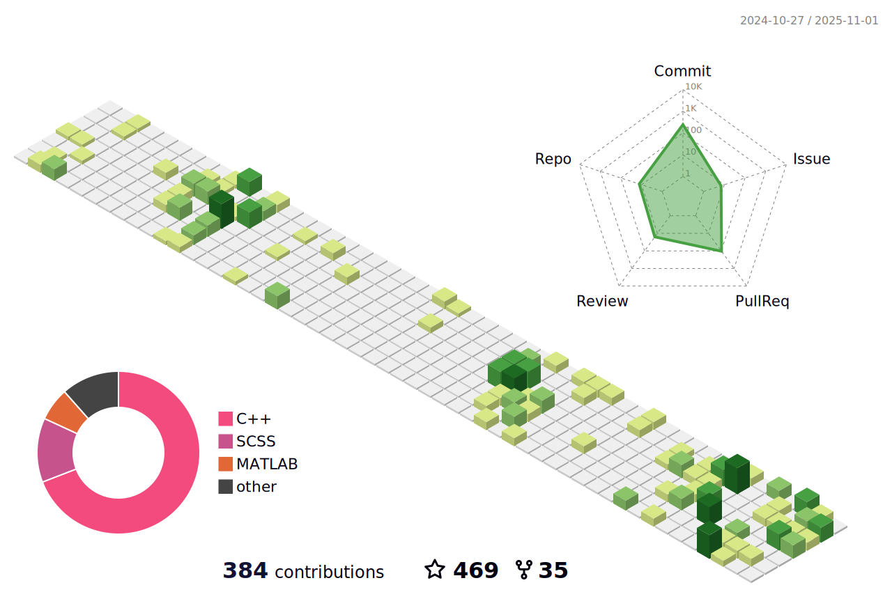

# Hi there 👋

- 🎓 I'm a Third year undergraduate student at [SUN YAT-SEN UNIVERSITY](https://www.sysu.edu.cn/).
- 🧱 My major is Intelligent Science and Technology.
- 💻 I am interested in Backend Development, Operating System, Deep Learning, Computer Version.
- 🖋 Here's my blog in CSDN: [@背包](https://blog.csdn.net/Yu_Cblog?spm=1000.2115.3001.5343)
- 📫 How to reach me:
  - Email:  yufc779@gmail.com
- **Check out what I'm currently working on**
  - [Yufccode/Load-balanced-online-OJ-system](https://github.com/Yufccode/Load-balanced-online-OJ-system) - This is a load-balanced OJ system project
  - [Yufccode/MIT6.824](https://github.com/Yufccode/MIT6.824) - I'm currently learning this course, here is my logs and codes
  - [https://github.com/Yufccode/CPlusPlus-review-main](https://github.com/Yufccode/CPlusPlus-review-main) - I'm currently reviewing C++ related knowledge points
  - [https://github.com/Yufccode/OperatingSys_ComputerNetwork_Review](https://github.com/Yufccode/OperatingSys_ComputerNetwork_Review) - I'm currently reviewing the knowledge points of the Operating System and the Computer Network
  - [Pulp-Carrier-Loading-Optimization-with-Gurobi](https://github.com/Yufccode/Pulp-Carrier-Loading-Optimization-with-Gurobi) - This is an operations research modeling project.

✨ **Contributions**

